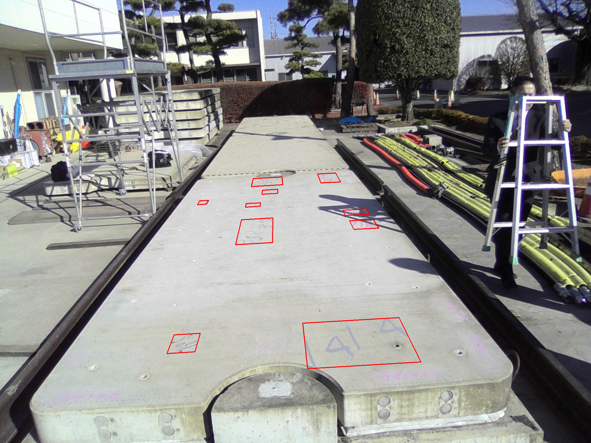

# Clone repo:
```bash
git clone https://github.com/phu2007vis/Text_Detection_Generation.git
cd Text_Detection_generation
```
```bash
python trdg_phuoc/generators/from_strings.py \
  --output_dir ./outs \
  --count 1300 \
  --aug \
  --background_dir trdg_phuoc/images \
  --color_path trdg_phuoc/font_colors.txt \
  --remove_exsist \
  --background_polygons trdg_phuoc/images/Label.txt

```

# Params:
-  Aug: augumentation the output images or not
- count: total images
- background_dir: image backgound dir
- backgound_polgons: define the region the the text do not out side


# Viusalization: python visaualize.py to assert the output format is correct
